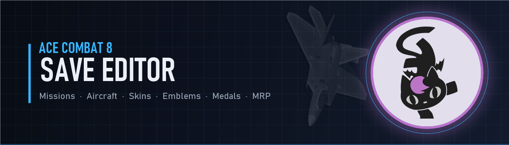

<p align="center"></p>

Save editor for ACE COMBAT 8: Wings of Theve. It opens Campaign.sav and System.sav, shows everything with the game's own names and icons, and writes the files back with a valid checksum so the game loads them.

## Features

- Overview: current and total MRP, campaign clears, saved difficulty, aircraft set slots, plus shortcuts to unlock Ace difficulty and to mark every mission S on Elite or Ace.
- Missions: all 31 sorties with one cell per difficulty (Rookie to Ace). Change the rank, add an S clear, or remove one.
- Aircraft, skins, emblems, parts: cards with the game's menu art. Tick to own, untick to remove. Search, filter, check or uncheck everything the filter shows.
- Special weapons: each aircraft card lists its three SP weapons. An aircraft you tick comes with SP1, the same as buying it in the hangar tree. Tick SP2 and SP3 to unlock the others.
- Medals and assault records, with the in-game hint for each.
- Features and flags: feature bits, menu flags, and the full unlock list with the condition the game checks for each entry.
- Options: every field in System.sav.
- Advanced: the raw property tree of both files.
- English by default, Portuguese (Brazil) in the dropdown.

Every save makes a timestamped backup in `SaveGames\backup_ac8edit` first.

## Download

Grab the zip from [Releases](../../releases), unzip anywhere, run `Ac8SaveEditor.exe`. No .NET install needed. Keep `assets.zip` next to the exe; the icons, names and descriptions come from it.

Close the game before saving. If you use Steam Cloud, turn it off for the game while you edit, or the cloud copy overwrites your file.

The editor reads saves from `%LOCALAPPDATA%\BANDAI NAMCO Entertainment\ACE COMBAT 8\Saved\SaveGames`. Use "Save folder..." in the top bar if yours are somewhere else.

## Building

Requires the .NET 10 SDK on Windows.

```
dotnet publish src/Ac8SaveEditor -c Release -r win-x64 --self-contained true -p:PublishSingleFile=true -p:IncludeNativeLibrariesForSelfExtract=true -p:EnableCompressionInSingleFile=true -o publish
```

The game data (icons, tables, text) is not in this repository. Download [assets.zip](https://github.com/RivaTesu/ac8-save-editor/releases/latest/download/assets.zip) and put it in the repository root before building, or next to the published exe afterwards. Without it the editor still opens and edits saves, just without names and pictures.

## Project layout

- `src/Ac8Save`: save parser and writer (GVAS, UE 5.4 property tags), checksum, typed campaign view, asset loader.
- `src/Ac8SaveEditor`: WPF app.

The parser round-trips both save files byte for byte before any edit and refuses to save if that check fails.

## Notes

- A mission needs an existing record before you can add clears to it. Finish it once on any difficulty first.
- Aircraft added with v1.0.0 have every special weapon locked in the hangar. Open them in v1.0.1 and tick the SP boxes.
- Achievements fire when the game evaluates them, not when the file changes.
- Tested with campaign save version 38.

## License

Source code is MIT, see [LICENSE](LICENSE). ACE COMBAT and all game content belong to Bandai Namco Entertainment Inc. This is an unofficial fan tool, not affiliated with or endorsed by Bandai Namco.
